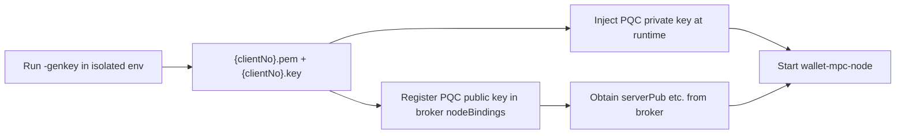

# PQC Node Key Pair Provisioning (ML-DSA-87)

This document describes how to use `wallet-mpc-node -genkey` to generate a **post-quantum cryptography (PQC) identity key pair** (ML-DSA-87) for WebSocket mutual authentication, including on-disk format, configuration wiring, and security practices.

---

## 1. Background

The node and **wallet-mpc-broker** establish mutual trust on the WebSocket layer using **PQC signatures** (ML-DSA-87):

| Role | Holds | Purpose |
|------|-------|---------|
| **Node (this repo)** | Local PQC private key `clientPrk` + broker PQC public key `serverPub` | Login via `/ws/login`; Sign / Verify protocol messages |
| **Broker (closed source)** | Broker PQC private key + each node's PQC public key | Authenticate nodes; issue sessions |

`-genkey` generates **only the node's own ML-DSA-87 PQC key pair**. It does not generate broker-side keys and does not write multiple private keys into one file.

After generation:

- `clientNo` — 18-digit PQC certificate number (same algorithm as admin `cipherNo`); use in `nodeBindings` / Plan2 routing
- Contents of `{clientNo}.key` → config field `clientPrk` or env `MPC_NODE_CLIENT_PRK`
- Contents of `{clientNo}.pem` → give to broker ops to register in that node's `nodeBindings` (broker-side; not done in this repo)
- `serverPub` still comes from broker `nodeBindings` — **not** from `-genkey`

---

## 2. Prerequisites

- Official `wallet-mpc-node` binary built or downloaded from [GitHub Releases](https://github.com/godaddy-x/wallet-mpc-node/releases) (see [README](README.md#official-releases))
- Run key generation in an **isolated, trusted** environment (see [§6 Security](#6-security))
- For production, prepare a strong passphrase to encrypt `private.key` on disk (env `MPC_PLAN2_WRAP_KEY`; name is implementation-defined, used as the PQC private-key wrap passphrase)

---

## 3. Commands and flags

```bash
wallet-mpc-node -genkey [-enc] [-outdir <directory>]
```

| Flag / env | Description |
|------------|-------------|
| `-genkey` | Generate PQC key pair, write files, then exit (does not start the node) |
| `-enc` | Require encrypted `private.key`; fails if `MPC_PLAN2_WRAP_KEY` is unset |
| `-outdir` | Output directory; default `plan2-provision` (resolved to an **absolute** path) |
| `MPC_PLAN2_WRAP_KEY` | User-supplied wrap passphrase; the program **reads only** — never generates or persists it |

### 3.1 Development / local (plaintext private key — debugging only)

```bash
wallet-mpc-node -genkey
# or specify output directory
wallet-mpc-node -genkey -outdir ./plan2-provision
```

If `MPC_PLAN2_WRAP_KEY` is unset, the program logs **WARN** and writes `private.key` in **plaintext**.

### 3.2 Production (encrypted private key — recommended)

```bash
# Linux / macOS
export MPC_PLAN2_WRAP_KEY='<strong passphrase; do not commit to shell history>'
wallet-mpc-node -genkey -enc -outdir /secure/path/node0-pqc

# Windows PowerShell
$env:MPC_PLAN2_WRAP_KEY = '<strong passphrase>'
.\wallet-mpc-node.exe -genkey -enc -outdir D:\secure\node0-pqc
```

### 3.3 Success output

```text
genkey: clientNo=202606171736131385
genkey: wrote /abs/path/plan2-provision/202606171736131385.pem /abs/path/plan2-provision/202606171736131385.key
```

---

## 4. Recommended workflow



### Step 1: Generate the PQC key pair

Run `-genkey` on the target node or a dedicated key-management workstation. Use `-enc` in production.

### Step 2: Verify output files

Default directory `plan2-provision/` (listed in `.gitignore` — **do not commit**):

| File | Mode | Content |
|------|------|---------|
| `{clientNo}.pem` | `0644` | **Single line** of standard Base64 ML-DSA-87 public key (no PEM headers, no JSON) |
| `{clientNo}.key` | `0600` | **Single line**: plaintext Base64 private key, or `plan2-provision-v1:` + AES-GCM ciphertext (Base64) |

`clientNo` is auto-generated (18 digits: `yyyyMMddHHmmss` + 4 random digits), matching admin PQC certificate numbering (`cipherNo`).

The directory itself is created with mode `0700`.

### Step 3: Register public key with broker

Provide the single-line Base64 from `{clientNo}.pem` to broker operations for the node's `nodeBindings` entry. Set `nodeBindings.clientNo` to the printed `clientNo`.

### Step 4: Configure the node

Copy [`examples/cli_node0.example.json`](examples/cli_node0.example.json) to `cli_node0.json` and fill in broker-supplied `serverPub`, `clientNo`, `broadcastKey`, etc.

**Private key wiring (choose one):**

| Environment | Method |
|-------------|--------|
| Development | JSON field `clientPrk`: single-line Base64 from decrypted `{clientNo}.key` |
| Production TEE | Env `MPC_NODE_CLIENT_PRK` (overrides JSON `clientPrk`) |

```bash
export MPC_NODE_CLIENT_PRK='<single-line Base64 from decrypted {clientNo}.key>'
export MPC_KEYSTORE_KEY='<shard at-rest encryption key>'
./wallet-mpc-node -config=cli_node0.json
```

> `MPC_KEYSTORE_KEY` encrypts **MPC shard files** on disk. It is **not** the same as `MPC_PLAN2_WRAP_KEY` (used only when running `-genkey` to wrap PQC `private.key`).

### Step 5: Start and verify

The node should complete PQC identity login and participate in MPC sessions. If login fails, verify `clientNo` and `serverPub` match broker `nodeBindings`, and that the private key matches the registered public key.

---

## 5. Encrypted private key format (`-enc`)

When `MPC_PLAN2_WRAP_KEY` is set:

1. The program AES-GCM-encrypts the payload «single-line Base64 private key + newline»
2. AES key = `SHA256(MPC_PLAN2_WRAP_KEY)`
3. AAD is the fixed string `plan2-provision-v1`
4. `private.key` contains: `plan2-provision-v1:` + Base64 ciphertext

Decryption requires the same `MPC_PLAN2_WRAP_KEY`. Decrypt logic lives in `freego`'s `ReadPlan2PrivateKey(dir, clientNo, wrapKey)` for tooling; at runtime the node typically receives the decrypted Base64 via `MPC_NODE_CLIENT_PRK`.

---

## 6. Security

### 6.1 Environment and binary

- Run `-genkey` only on **official releases** or trusted builds from this repository (see README CAUTION)
- Generate keys on dedicated, network-isolated machines; avoid leaving plaintext `private.key` on shared dev hosts
- After provisioning, **securely delete** temporary plaintext copies and clear passphrases from shell history per your policy

### 6.2 Private key protection

| Risk | Mitigation |
|------|------------|
| Plaintext `{clientNo}.key` leak | Production **must** use `-enc` + strong `MPC_PLAN2_WRAP_KEY`; never commit plaintext keys to git, chat, or tickets |
| Wrap passphrase leak | Store `MPC_PLAN2_WRAP_KEY` separately from the private key; never write it to disk or JSON |
| Runtime exposure | Inject `MPC_NODE_CLIENT_PRK` via TEE / KMS in production; omit `clientPrk` from JSON |
| File permissions | Ensure `{clientNo}.key` is `0600` and directory `0700`; avoid world-readable paths |

### 6.3 Public key and broker coordination

- Each node has its **own** PQC key pair; never share one `clientPrk` across nodes
- Rotating keys requires updating **both** broker-registered public key and node private key, or login will fail
- `serverPub` must come from official broker configuration; do not generate it locally

### 6.4 Distinction from MPC shard keys

| Material | Purpose |
|----------|---------|
| PQC `clientPrk` / `{clientNo}.pem` | WebSocket identity; ML-DSA signature layer |
| `keystoreKey` / `MPC_KEYSTORE_KEY` | Encrypt local MPC shard files |
| MPC threshold shards | On-chain signing (CGGMP / FROST); created by Keygen; stored under `keysdir` |

These serve different roles; rotation and backup policies should be defined separately.

### 6.5 Program boundaries

- The program **never** generates or saves `MPC_PLAN2_WRAP_KEY`
- Without wrap key and without `-enc`, it only WARNs then writes plaintext (for local debugging — **not for production**)
- `-genkey` exits after writing files; private key material is **not** printed to logs

---

## 7. Implementation references (audit)

| Component | Location |
|-----------|----------|
| CLI entry | `entry.go` → `runGenKey()` |
| PQC key pair generation and provisioning | `freego` `utils/crypto/plan2_binding.go` |
| Runtime private key injection | `config.go` → `MPC_NODE_CLIENT_PRK` |
| Unit tests | `entry_genkey_test.go` (on-disk read + ML-DSA Sign/Verify) |

---

## 8. FAQ

**Q: Why isn't `{clientNo}.pem` a standard PEM block?**  
A: This project uses a **single line of Base64** ML-DSA-87 key material for TEE injection and config management — no `-----BEGIN ...-----` headers.

**Q: Why does `{clientNo}.key` contain only one line?**  
A: One file, one PQC private key. Broker-side keys are managed by the broker and are not combined with node private keys.

**Q: What is `clientNo`?**  
A: An 18-digit PQC certificate number (`yyyyMMddHHmmss` + 4 random digits), same scheme as admin `cipherNo`. It names the output files and maps to Plan2 / binding `clientNo`.

**Q: What if I forget `MPC_PLAN2_WRAP_KEY`?**  
A: Encrypted `{clientNo}.key` cannot be recovered. Re-run `-genkey` and update the public key on the broker.

**Q: Can the node process read `{clientNo}.key` automatically?**  
A: Current design expects operators to inject decrypted Base64 into `MPC_NODE_CLIENT_PRK` (or JSON in dev). `-genkey` is offline provisioning only.
